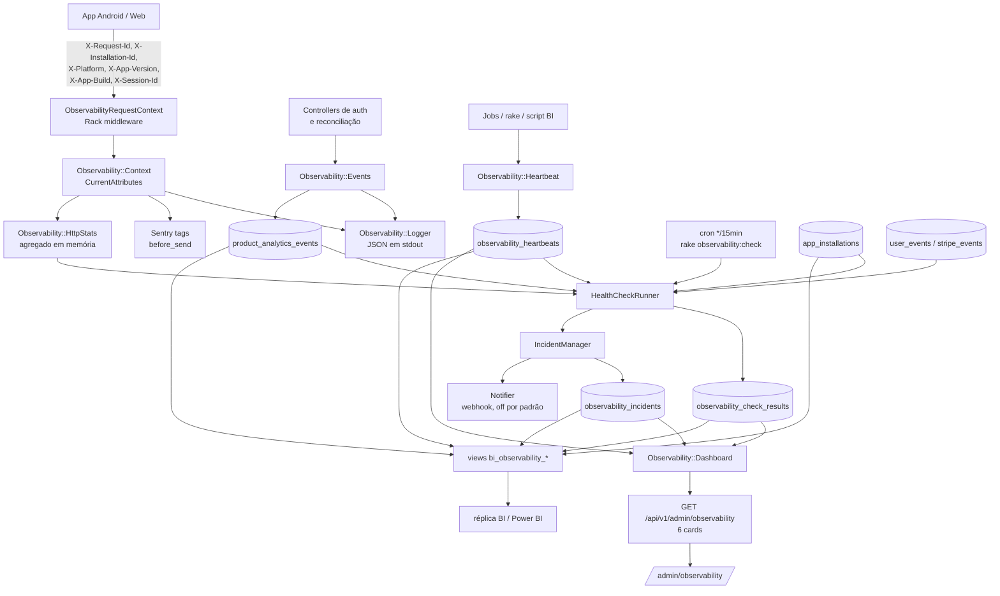

# Arquitetura de Observabilidade — EasyHealth

## Fluxo geral



## Fluxo de correlação

Tudo se amarra por `request_id`:

1. O middleware lê `X-Request-Id` (ou usa o gerado pelo `ActionDispatch::RequestId`) e devolve na resposta.
2. `Observability::Context` carrega esse id por toda a requisição.
3. Ao enfileirar um job, o `request_id` viaja no payload (`ObservabilityInstrumented#serialize`) e é restaurado no `perform` — um log dentro do job aponta para a requisição que o originou.
4. Sentry recebe o mesmo `request_id` como tag.
5. Rake tasks usam `Observability::Context.for_task`, que gera `task-<hex>`.

Assim, uma exceção no Sentry, uma linha de log, um evento em `product_analytics_events` e um incidente podem ser cruzados sem investigação manual.

## Fluxo de logs

Stream **separado**, não substitui o `config.logger`. Ambos saem em stdout.

Motivo: `config.log_tags`, `ActiveSupport::TaggedLogging` e `config.silence_healthcheck_path = "/up"` já estão configurados e funcionando. Trocar o formatter (ou adicionar lograge, que disputa o mesmo hook) colocaria os três em risco sem ganho — e apenas um dos eventos exigidos (`http_request_completed`) é uma requisição de controller; o resto vem de jobs, services e rake, onde lograge não tem gancho.

## Fluxo de incidentes

```
CheckResult(alerting)  → fingerprint → existe incidente ativo?
                                        ├── não → abre + notifica
                                        └── sim → occurrence_count++
                                                  escalou? → notifica (ignora cooldown)
                                                  senão   → notifica se cooldown venceu

CheckResult(healthy)   → resolve o incidente daquele fingerprint + notifica

CheckResult(insufficient_data) → NADA
```

A última linha é deliberada: não medimos, então não podemos afirmar nem problema nem recuperação. Resolver automaticamente aqui fecharia um incidente real assim que o tráfego secasse.

O fingerprint considera `source + check_key + dimensões permitidas + ambiente`. As dimensões passam por uma allow-list de baixa cardinalidade (`build_group`, `auth_flow`, `heartbeat_key`, ...). **Um ref de usuário no fingerprint criaria um incidente por usuário afetado** e tornaria o painel inútil.

Unicidade no banco: índice parcial `(fingerprint) WHERE status <> 'resolved'` — reincidência após resolução abre um incidente novo, corretamente.

## Decisões e por quê

### Middleware Rack, não concern de controller

- `Api::V1::Integrations::Make::PushDispatchesController` herda `ActionController::API` direto; um concern em `ApplicationController` o ignoraria em silêncio.
- Status e duração precisam cobrir o que nunca chega a um controller: 429 do rack-attack, 404 de rota inexistente, 500 renderizado pelo `ShowExceptions`.
- `AppInstallationReconciliation` é um `after_action`; o `ensure` do middleware roda depois dele.

Fica em `api/lib/middleware/` (excluído do `autoload_lib`) porque `config/application.rb` precisa da constante real no boot, e constantes autoloaded não podem ser referenciadas durante a inicialização.

### Checks por cron + rake, não job auto-reagendado

`config.active_job.queue_adapter` nunca foi definido → adapter `:async`, em processo, **jobs perdidos a cada restart**. Um checker que se reagenda ficaria cego depois de todo deploy — justamente a camada que não pode ficar cega. A classe `ObservabilityHealthCheckJob` existe para manter a lógica portável quando houver fila durável.

### `insufficient_data` em vez de zero

Amostra abaixo do piso → `status = insufficient_data` e `current_value = nil`. Vale em `CheckResult`, no JSON dos cards, no React (`metric-cell.tsx`) e no SQL (`NULLIF(den, 0)`).

"0% de conversão" e "não foi possível medir a conversão" são afirmações diferentes, e só uma delas é verdadeira quando ninguém instalou o app nas últimas seis horas.

### Coortes de build separadas

Builds abaixo de `AppInstallation::RECONCILIATION_MIN_BUILD` (45) nunca enviaram `X-Installation-Id` e são **esperadamente** anônimos. Misturá-los faz um release saudável parecer quebrado — e esconde um quebrado atrás de tráfego antigo.

### Sanitização mais estrita que a do Make

`RelationshipEventTracker.sanitize_metadata` mantém `email`, `name` e `phone` porque o pipeline do Make existe para enviar mensagens a pessoas e precisa deles. Log não precisa. Daí a segunda passada em `Observability::Logger::PERSONAL_KEY_PATTERN`, em vez de endurecer o sanitizador compartilhado e quebrar os payloads do Make.

## Tripwires

Coisas que passam a estar **erradas em silêncio** se alguém mudar:

| Se alguém… | Quebra | Onde está avisado |
|---|---|---|
| adicionar `workers` em `config/puma.rb` | `HttpStats` passa a ver um worker só; `:memory_store` vira um cache por worker | comentário no topo de `puma.rb` |
| adicionar eventos em `events.yml` sem espelhar em `taxonomy.ts` | spec de paridade falha | comentário no próprio YAML |
| criar `Api::V1::Observability` | referências não qualificadas no controller admin resolvem para a constante errada | comentário no `observability_controller.rb` |
| criar banco novo com `db:schema:load` | nenhuma view `bi_observability_*` existe | [BI_VIEWS.md](BI_VIEWS.md) |
| mudar `CRON_SCHEDULE` da réplica | `replica_refresh_stale` alerta na hora errada | `BI_REPLICA_EXPECTED_HOUR` |

## O que ainda não existe

Honestamente declarado, porque o painel não deve sugerir cobertura que não tem:

- **Sem métricas de infraestrutura.** Nada de CPU, memória, disco, restart de container ou conexões do PostgreSQL. O card "API & Infraestrutura" mede apenas 5xx e p95 do processo Puma vivo, em memória, últimos 15 minutos, zerando a cada deploy — e diz isso em `data_quality.notes`.
- **Sem traces.** Sem OpenTelemetry.
- **Sem endpoint Prometheus.** `HttpStats` já é a fonte pronta para um exporter futuro.
- **Sem coletor externo.** Logs JSON saem em stdout e ficam no driver `json-file` do Docker.
- **Sem webhook do Grafana.** A coluna `source` de `observability_incidents` já aceita `grafana`.
